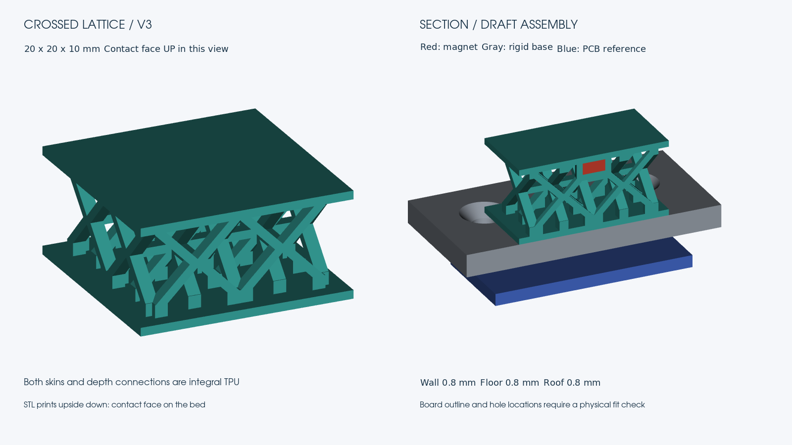

<!-- tactile-fingertip/README.md: Current single TPU cushion and provisional rigid fixture exports. -->
# Magnetic fingertip v3: two skins and connected depth ribs

[TPU fingertip STL](fingertip.stl) · [Parametric source and printing procedure](../../src/tactile_fingertip/README.md)

The **20 × 20 × 10 mm** cushion has continuous **0.8 mm top and bottom skins**, perpendicular diamond-rib banks, and four internal ties. The middle core stays connected after excluding both skins and the magnet enclosure. The magnet remains embedded in the single TPU part; no separate magnet holder or contact cover is needed.

The preview shows the **contact face on top**, with the magnet just below it. The backing face is underneath. The exported STL is upside down relative to that view: print the contact face on the bed. The reference magnet and board are not part of the cushion STL.

- Magnet cavity: exact nominal diameter **3 mm**, depth **1.5 mm**.
- Radial pocket wall, floor and roof: **0.8 mm** each; locally thicker at rib junctions.
- Diamonds: outer diagonals **8.8 mm**, strut normal thickness **0.8 mm**, rib depth **1.2 mm**.
- Mid-height ties: **17.2 × 1.2 × 0.8 mm**, four beams connecting both directions.
- Use uniform **0.1 mm layers**, including the first layer; pause after completed **Z = 2.3 mm**, before any roof-closing toolpath. Insert the magnet, then resume.

STL does not store the pause. Inspect the actual sliced toolpaths. The second skin and internal ties require bridging trials in TPU; solid CAD connectivity is not proof of successful printing. No actual print, fit, force, or sensing test has been performed.

## Optional rigid backing: provisional board fit

[Draft base STL](mount-draft.stl) · [Draft dimensions and assumptions](mount-draft.json)

The **34 × 34 mm** rigid base has a **3 mm plate and two 3 mm standoffs**. The cushion's backing skin bonds to the flat plate face; the PCB mounts behind it on the standoffs, with the sensor IC facing the cushion. Flush flat-head screws enter from the cushion side; fit them before bonding. Confirm head clearance and use suitable nonmagnetic hardware. This base is separate from the one-piece TPU cushion and is not a robot-jaw adapter.

The owner's annotated CJMCU-90393 image gives a **26.3 × 26 mm** board. The selected [product listing](https://www.amazon.co.jp/dp/B0H8H693VS) gives a conflicting 20.4 mm square outline. Use the image dimensions provisionally and measure the delivered board.

Hole centers **X = ±10, Y = +10 mm** are estimated from the image. The base's **3.2 mm holes and 6.2 mm / 90-degree countersinks** are chosen for trial M3 fasteners; they do not assert the actual PCB hole diameter. Board thickness 1.6 mm and sensing-plane offset 0.5 mm are assumptions. The blue PCB preview is an outline reference and omits components/connectors.

The draft assembly implies **13.95 mm** magnet-center-to-sensing-plane spacing before adhesive. Its sensitivity is untested. This replaces the earlier 10 mm coupon-only fixture spacing when using this base. Verify both mechanical fit and signal range before using it on the gripper.

## Digital checks

Ten fingertip tests and three draft-mount tests passed. [Fingertip validation](validation.json) records dimensions, volumes, STL SHA-256 and pause coordinates.

The cushion is one valid CAD solid with two surface shells: exterior and enclosed magnet cavity. STL is watertight with consistent winding; cavity and total volumes match CAD. Every default print-layer prefix connects to the bed. Both end skins, the internally connected core, and 90-degree rotational symmetry are tested. Geometry symmetry does not establish mechanical isotropy.

The draft-base checks cover the single plate/boss solid, screw access, geometric cushion clearance, invalid dimensions, and STL export. They do not establish purchased-board compatibility, fastener fit, adhesive durability or component clearance.

Keep only current files in this directory. Replace them in place; do not retain old models or version subdirectories. Geometry exports are STL only.
