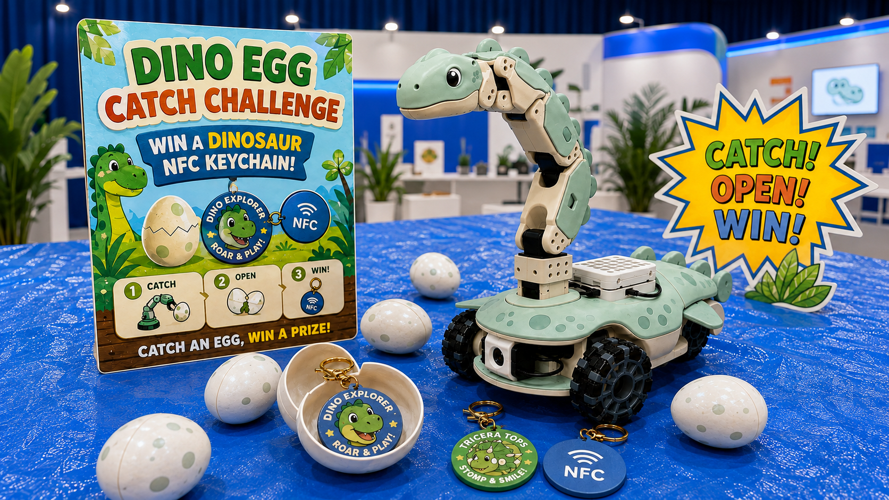

<!-- README.md: Project entry point for the concept and repository layout. -->

# Dino Egg Catch Challenge

**We will be exhibiting Dino Egg Catch Challenge at Maker Faire Bay Area 2026!**

A hands-on dinosaur robot experience using a LeKiwi mobile base and an SO-ARM101 arm. Visitors aim to catch egg capsules with the dinosaur's mouth. The current prize plan includes 100 KachiButton USB keyboard keychains and approximately 100 NFC-enabled dinosaur keychains.

This repository contains planning documents, SO101 reference models, custom CAD prototypes, and a parametric magnetic tactile fingertip generator. Robot control and attendee controller software remain planned; the fingertip exports have not been physically qualified.

## Repository layout

| Path | Purpose |
| --- | --- |
| [src/robot/](src/robot/README.md) | SO-ARM101 and LeKiwi control, integration, and operating modes |
| [src/controller/](src/controller/README.md) | Attendee controller inputs and interaction code |
| [src/tactile_fingertip/](src/tactile_fingertip/README.md) | Parametric magnetic fingertip CAD, STL export, and geometry checks |
| [3d-models/](3d-models/README.md) | Reference CAD, custom parts, and fabrication exports |
| [docs/concept.md](docs/concept.md) | Experience, appearance, prizes, development direction, and sources |
| [docs/makerfaire/](docs/makerfaire/README.md) | Current Maker Faire application materials |
| [AGENTS.md](AGENTS.md) | Shared language and development instructions |
