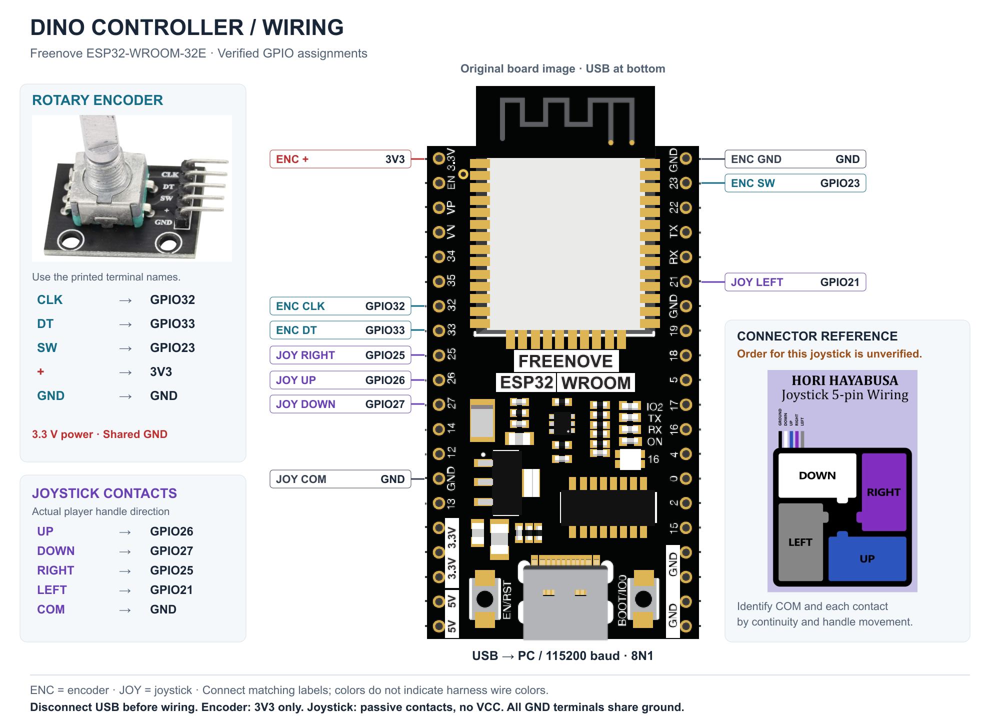
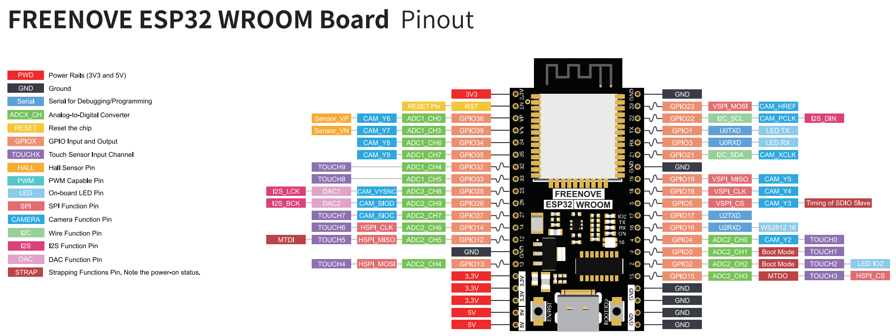

<!-- docs/dino-controller-wiring.md: Show source-based pin positions and distinguish verified signal wiring from an unverified connector order. -->
# Illustrated Controller Wiring

Current signal assignments accepted by the owner on **2026-09-19**. Disconnect USB before changing wires. Use the GPIO labels printed on this Freenove board. Row numbers in the position table below count physical header positions, not GPIO numbers.

**How to read the drawing:** USB is at the bottom and the antenna at the top, viewed from the component side. Connect matching signal labels. Short lines identify individual terminals; they are not a continuous wire running between adjacent labels. Line colors distinguish signals and do not specify harness wire colors. `ENC` means encoder and `JOY` means joystick.

The ESP32 board is a direct crop of [Freenove-ESP32-Dev-Board.png](../images/dino-controller/Freenove-ESP32-Dev-Board.png), enlarged uniformly by 2x using nearest-neighbor sampling. Its original pixels and pin layout are preserved; every annotation is outside that board rectangle. The exported PNG board region was compared with the enlarged source crop and had zero differing pixels. An editable, self-contained [SVG version](../images/dino-controller/controller-wiring.svg) is also available.

Encoder terminal order follows the supplied photo. GPIO mapping was checked against [config.h](../src/dino-controller/config.h). The illustration uses example GND/3V3 terminals; other terminals labeled GND/3V3 on this same board share their respective rails. The owner's exact choice among duplicate supply/ground pins was not recorded.

## ESP32 header positions

Count down each header from the antenna end while keeping USB at the bottom. Positions below apply to the supplied Freenove pinout, not every ESP32 development board.

| Connection | Printed board label | Side / row from top in drawing |
| --- | --- | --- |
| Encoder + | 3V3 | Left / 1 |
| Encoder CLK | 32 | Left / 7 |
| Encoder DT | 33 | Left / 8 |
| Joystick RIGHT | 25 | Left / 9 |
| Joystick UP | 26 | Left / 10 |
| Joystick DOWN | 27 | Left / 11 |
| Joystick COM | GND | Left / 14, example ground |
| Encoder GND | GND | Right / 1, example ground |
| Encoder SW | 23 | Right / 2 |
| Joystick LEFT | 21 | Right / 6 |

Do not connect an input using row number alone: check the printed GPIO label. GPIO14, for example, is not the joystick DOWN input; **DOWN is GPIO27**.

## Rotary encoder: use printed terminal names

In the [supplied encoder photo](../images/dino-controller/rotary-encoder-reference.png), with the shaft upward and the header pointing right, terminals appear **top to bottom: CLK, DT, SW, +, GND**. Turning the module changes that visual order; the printed names remain authoritative.

| Encoder terminal | Connect to | Purpose |
| --- | --- | --- |
| CLK | GPIO32 | A phase |
| DT | GPIO33 | B phase |
| SW | GPIO23 | Shaft switch |
| + | **3V3** | Module supply and its pull-ups |
| GND | GND | Shared ground |

Power this module at **3.3 V, not 5 V** so its pull-ups cannot drive ESP32 inputs to 5 V. SW reads LOW when pressed. Current configuration uses resting `ab=3`, four edges per decoded step, and `kEncoderInvert=true`. With this wiring and correction, the owner accepted CW/+1 and CCW/-1. See [encoder calibration](dino-controller-encoder.md).

## Joystick: actual handle direction is authoritative

| Move the handle | Contact connects to | RGB feedback |
| --- | --- | --- |
| UP | GPIO26 | Red |
| DOWN | GPIO27 | Green |
| RIGHT | GPIO25 | Blue |
| LEFT | GPIO21 | White |
| Common contact | GND | Shared return |

This is a passive switch joystick: **no VCC wire**. Each directional contact closes to common GND; internal pull-ups make released inputs HIGH. Keep the existing working wiring and use the corrected logical mapping above. On diagonals, serial retains both contacts and the LED prioritizes the vertical direction.

The [supplied HAYABUSA image](../images/dino-controller/joystick-connector-reference.png) depicts another product and suggests `GND / DOWN / UP / RIGHT / LEFT`. Its order, viewing side, colors, and switch labels have **not** been established for this joystick. Therefore the illustration connects functional contacts to GPIOs without claiming a numbered five-position connector mapping.

For a replacement harness, disconnect it from the unpowered ESP32 and use continuity mode. Find the pair that closes for each actual handle direction; the wire shared by all four pairs is common. Photograph the connector/latch and label the four remaining wires. Mechanical switch location beneath the stick can oppose handle movement. Record the result using the [continuity worksheet](dino-controller-validation.md).

## Original board reference

The original remains the source for header positions and unused pins; the [supplied board photograph](../images/dino-controller/esp32-board-reference.png) also shows the component-side orientation. Board USB provides power and serial to the PC; no extra UART wires are required. The WS2812 is already wired onboard to GPIO16.

## Image sources and reproducibility

The owner supplied the board pinout, encoder photograph, and HAYABUSA reference. The current illustration embeds those source images in an SVG composition and exports it to PNG. The [image source record](../images/dino-controller/controller-wiring.prompt.md) documents crop coordinates, rendering, and the pixel-preservation check. Connector uncertainty remains explicit; the picture does not establish a numbered joystick harness order.

Next: [build/upload/debug](dino-controller-development.md) and [JSON messages](dino-controller-protocol.md).
