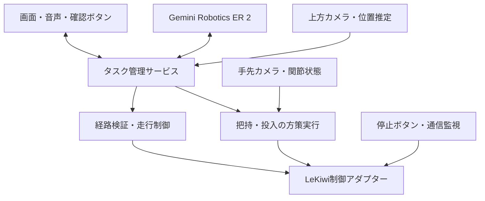

# DINO EGG CATCH CHALLENGE — Gemini Robotics 組み込み案

作成日：2026-09-24  
対象：恐竜型LeKiwi＋SO-ARM101  
位置づけ：実装前の設計案。API仕様は公式資料で確認済み。実機での精度・遅延・成功率は未検証。

## 1. 実現する体験

**「話しかけると、恐竜が探し、こちらに確認し、卵を回収してくれる」体験を作る。**

参加者が「緑の卵を取って」と伝えると、上方カメラ映像の候補に四角い枠を表示し、「この卵でいい？」と確認する。OKを受けて恐竜が近づき、口でつかみ、戻ってバスケットに入れる。途中の「待って」「やっぱり赤い卵」にも対応する。

本案の基本構成は、**Gemini Robotics ER 2による対象理解・工程判断と、ローカルの移動制御・学習済み把持動作を接続する方式**とする。

### 現状と設計上の前提

- 恐竜外装のLeKiwiで、テレオペによる卵の把持は実現済み。
- ゴルフボールのACT実験では、フロント＋手先より、手先カメラのみのほうが精度が高かった。
- 卵のピックアップ方策とバスケット投入方策は、本案で学習・検証する対象とする。完成済みとは扱わない。
- 床はブルーシート、周囲は高さ約10cmの水色スタイロフォーム。
- 固定した上方カメラを追加し、フィールド、ロボット、卵、バスケットを観測する。
- フィールド寸法、走行可能範囲、ロボット外形、口の到達範囲は実測して設定する。
- 初期版ではバスケットの位置を固定する。

## 2. デモの流れ

| 段階 | 参加者に見える動作 | システム側の処理 |
|---|---|---|
| 1. 指示 | 「緑色の卵を取って！」 | 発話・文字入力を受け付ける |
| 2. 発見 | 上方映像の卵に枠が付く | ER 2が候補を特定し、アプリが枠を描画する |
| 3. 確認 | 「この緑の卵でいい？」 | 対象IDと確認待ち状態を保持する |
| 4. 承認 | 「OK！」 | 最新映像と対象を照合して確定する |
| 5. 接近 | 予定経路が表示され、恐竜が動く | 経路候補を検証し、ローカル制御で追従する |
| 6. 位置合わせ | 卵の前で停止する | 卵が把持方策の対応範囲にあるか確認する |
| 7. 把持 | 口で卵をつかむ | ベースを停止し、把持方策を実行する |
| 8. 成否確認 | 「取れたよ！」または「もう一度やってみるね」 | 画像・状態から保持の成否を確認する |
| 9. 帰還・投入 | 戻ってバスケットへ入れる | 帰還経路を検証し、定位置で投入方策を実行する |
| 10. 完了 | 成功表示と恐竜のリアクション | 卵の投入を確認し、次の参加者を待つ |

「取れた」「入った」という発話は、動作コマンドの終了だけで出さず、結果を確認してから出す。

## 3. 採用するGeminiモデル

公式名称は **Gemini Robotics ER 2**。以下の公開プレビューAPIを利用する。[1]

| 用途 | モデル／方式 | 本案での採用 |
|---|---|---|
| 画像による対象選択、工程判断、失敗時の再判断 | `gemini-robotics-er-2-preview` | 最初の試作で採用 |
| 継続的な音声・映像入力を使う対話 | `gemini-robotics-er-2-streaming-preview` | 基本動作の成立後に追加 |
| 返答の読み上げ | 別のTTS | 短い定型文から導入 |
| 卵の把持・投入 | ローカルのACT | 個別に学習・検証 |
| 把持方策の比較実験 | SmolVLA | ACTと同じ収録条件で比較 |

Gemini Robotics 2のVLAとOn-Deviceモデルは、公式発表では早期アクセスのパートナー向け。本案はそれらの利用権を前提にしない。[2]

### 最初は通常版を使う理由

最初の試作では「対象選択」「把持後」「投入後」などの節目に画像を渡す。入力画像、回答、実機結果を対応づけて確認しやすく、背景認識と制御の問題を切り分けやすい。

通常版でもアプリ側は随時入力を受け付けられる。途中指示を受けたら実行中の処理を停止・更新し、必要な時点でER 2を再呼び出す。

### Streaming版へ移行する際の仕様

ER 2 StreamingはLive APIを使う双方向接続で、出力はテキスト。音声で返答するには別途TTSを接続する。公式仕様の映像入力はJPEGで最大1fpsであり、ローカルのカメラ取得・制御周期とは分ける。[3]

また、以下を実装する。

- 物理動作のツールは、仕様に従ってBLOCKINGで登録する。
- ツール実行中も、アプリの入力・取消・停止処理は別タスクで動かす。
- 映像送信だけに依存せず、必要なタイミングで観測を促す入力を送る。
- 定期的な観測要求は前の応答完了を待ち、連続した割り込みで推論をキャンセルし続けない。
- 再接続時は実機状態とタスク状態を再同期し、古い動作を自動再送しない。

Gemini Liveの音声会話モデルを別に使う構成も可能だが、初期版ではER 2＋TTSにまとめる。複数モデルを使う場合も、実機コマンドの実行権限は一つの制御サービスに集約する。

## 4. システム構成



### 各コンポーネントの責務

| コンポーネント | 責務 |
|---|---|
| 画面・音声UI | カメラ映像、候補の枠、確認、短い進捗説明、停止・手動操作 |
| Geminiアダプター | モデル呼び出し、入力画像と状態の送信、回答／関数要求の受信 |
| タスク管理サービス | 対象ID、確認状態、工程、取消、実行中動作を一元管理 |
| 位置推定 | ロボットと卵の位置、バスケット、観測時刻を管理 |
| 経路計画・検証 | フィールド内の経路、障害物回避、到着姿勢の算出 |
| 走行制御 | 現在位置との差から速度を補正し、オムニホイールを制御 |
| 方策実行 | ACT／SmolVLAへの入力、推論、アーム動作、終了条件の監視 |
| LeKiwi制御アダプター | ベース・アームへの命令、状態取得、停止、通信監視 |

Geminiに渡すのは、対象ID、工程、観測、実行可能な高水準ツール。各ホイールの速度や毎フレームの関節角度はローカルで扱う。

## 5. 卵の選択と確認

### 5.1 枠の表示

ER 2は物体の位置やバウンディングボックスを返せる。[4]

1. 上方カメラの画像を撮影し、アプリで `frame_id` と撮影時刻を付ける。
2. ユーザーの指示と画像をER 2へ送る。
3. 対象候補の座標を受け取る。
4. アプリで形式・範囲を検証し、追跡対象にIDを付ける。
5. 同じ画像上に枠を描き、「これでよい？」と表示する。

以下はアプリ内のデータ形式案であり、Googleの固定レスポンス形式ではない。

```json
{
  "frame_id": "overhead-00421",
  "target_id": "egg-03",
  "label": "green egg",
  "bbox_yxyx_1000": [310, 470, 420, 560],
  "confirmation_status": "pending"
}
```

座標順は `[y_min, x_min, y_max, x_max]`、範囲は0〜1000に統一する。画像幅W・高さHに対し、x方向はW/1000、y方向はH/1000を掛けて画素に変換する。画面に余白や拡大縮小がある場合は、その表示変換も反映する。

### 5.2 確認後の扱い

- 確認は色名だけでなく `target_id` と結び付ける。
- 同じ色の卵が複数ある場合は、候補を順に表示するか「右側の卵？」と聞く。
- 音声のOKに加え、画面のOKボタンを用意する。
- 対象変更時は前の確認を無効にする。
- 撮影後に卵が移動した場合は位置を更新する。同一対象か判断できない場合は再確認する。
- 古いフレームへの遅延応答は、そのまま現在の走行指示に使わない。

枠の表示にはモデルの座標を使えるが、その座標を直接モーター指令には変換しない。

## 6. 移動計画とオムニホイール制御

### 6.1 座標とキャリブレーション

フィールド上にメートル単位の座標系を設定する。上方カメラを固定し、床面の基準点を使って画像と床面の対応を求める。

ロボットの位置・向きは、上面に付けたAprilTag等のマーカーを使う方式を候補とする。マーカーの取付高さ、ベース中心との位置・向きの差も校正する。

卵の画像中心には床からの高さがあるため、床面の変換をそのまま適用すると誤差が出る。接地点の推定、既知のサイズ・カメラ校正を使った補正、最後の手先カメラによる位置合わせを組み合わせる。

### 6.2 Geminiが提案し、ローカルで実行可能な経路にする

Geminiは「どの卵へ、どちら側から近づくか」「回収後どこへ戻るか」を判断し、必要なら経由点の候補を返す。

アプリ側では次の処理を行う。

1. 卵の位置から、把持に適したベースの位置・向きを算出する。
2. ロボット外形と余裕を考慮して、壁や他の卵への接触を避ける。
3. 直線で到達できれば直線、できなければA*等で経路を生成する。
4. Geminiの経路候補がある場合も、同じ幾何検証を通す。
5. 実行する経路を画面に表示する。
6. 現在位置を継続観測し、閉ループで経路に追従する。

**目標は卵そのものの座標ではなく、卵を口で取れるベースの停止位置。** 口までの距離や恐竜外装の張り出しを含めて計算する。運搬中は卵を含めた外形で経路を検証する。

### 6.3 把持への引き渡し条件

以下を満たしたら把持工程へ移る。

- ベースが停止している。
- 対象が手先カメラで見えている。
- 卵の位置・大きさ・アームの開始姿勢が、学習時に検証した範囲内にある。
- 対象の取り違えや他の卵との重なりがない。

許容する位置・角度誤差は、実機の把持成功範囲を測って決める。範囲外なら位置合わせをやり直す。

## 7. 把持・投入スキル

まずは二つの方策を別々に作る。

| スキル | 開始条件 | 終了条件 |
|---|---|---|
| `pick_egg` | ベース停止、口が空、対象が把持範囲内 | 卵を保持し、走行可能な姿勢になった |
| `place_in_basket` | ベースが投入位置で停止、卵を保持 | 卵を離し、アームが退避した |

入力は、手先カメラ画像と必要な関節状態を基本とする。フロントカメラの追加は比較実験で効果を確認してから行う。

ACTの推論・実行周期は収録条件と実機性能に合わせる。動作列を一度に最後まで流し切らず、途中停止を受け付けられる実行器にする。

### 成功判定

- 把持：口付近の画像、持ち上げ後の卵の動き、取得可能ならグリッパー状態などを組み合わせる。
- 投入：バスケット内の卵と口が空いたことを確認する。必要ならバスケット向けの視点を追加する。
- 画像が隠れて判定できなければ `unknown` とし、成功扱いにしない。
- 自動再試行は、再び同じ開始条件に戻せる場合に限る。
- 初期版は1回の自動再試行を上限とする設計案。上限後はスタッフ操作へ移る。

### ブルーシートへの対応

手先カメラのみでの成功を基準にし、シワ・照明・影を変えた実演を追加する。明るさやコントラストの画像拡張も使う。LeRobotでは既存データへ学習時に画像拡張を適用できる。[7]

色で卵を選ぶ学習では、大きすぎる色相変更を避ける。シワで卵の高さや転がり方が変わる条件は、実際の動作データに含める。

ACTとSmolVLAは同じデータ・同じ未学習条件で比較し、展示での成功率を基準に採用する。

## 8. Geminiへ公開するツール

以下は新たに実装するアプリ独自のAPI。Geminiに組み込み済みのLeKiwi操作APIではない。Google公式もカスタムロボットAPIを使う工程制御を案内している。[5]

| ツール名 | 主な引数 | 実行する処理 |
|---|---|---|
| `get_scene` | 必要な観測種別 | 最新画像、対象一覧、実機状態を返す |
| `propose_target` | 対象IDまたは候補領域 | 枠を表示し、ユーザー確認を開始する |
| `plan_navigation` | 目的地ID、接近方針、任意の経由点候補 | 実行可能な経路を作り、`plan_id` を返す |
| `execute_navigation` | `plan_id` | 検証済み経路を走行する |
| `run_skill` | スキル名、対象ID | 把持または投入を実行する |
| `verify_result` | 確認したい結果 | 観測を返し、成否を検証する |
| `pause_task` | 理由 | 進行を止め、実機状態を保持する |
| `request_target_change` | 新しい対象条件 | 現在の動作を整理して再確認へ移る |
| `speak` | 読み上げる文 | TTSと画面に短い説明を出す |

ツール結果には `succeeded / failed / cancelled / unknown` と観測時刻、実機の最新状態を含める。状態によって実行できない要求には、成功を返さず理由を返す。

### 実行サービスのルール

- 一つの実機に対して、同時に有効な動作は一つにする。
- 移動と把持を初期版では同時実行しない。
- `action_id` と `task_version` で重複実行と古い要求を防ぐ。
- Geminiに確認済みと言わせるだけでは動かさず、アプリが保持する確認記録を検証する。
- ツールのタイムアウト時は実行器へ取消を送り、停止を確認するまで次の動作を開始しない。
- 任意コードや任意のシェルコマンドを実機側で実行するツールは用意しない。

## 9. 途中指示と状態管理

基本状態は、待機、対象確認、移動、位置合わせ、把持、保持確認、帰還、投入、完了。別に、一時停止と復旧待ちを設ける。

| 指示・状況 | 挙動 |
|---|---|
| 「待って」 | 動作を停止し、対象と工程を保持する |
| 「続けて」 | 最新の対象・姿勢を再確認して再開する |
| 「やっぱり赤い卵」：移動中 | 停止し、新しい対象に枠を出して確認する |
| 「やっぱり赤い卵」：把持中 | 把持処理を中断可能な状態へ移し、保持状態を確認する |
| 「やっぱり赤い卵」：保持中 | 持っている卵をどう置くか確認し、処理後に新対象へ移る |
| 手動操作への切替 | 自動動作を取り消し、手動側に制御を渡す |
| 通信断・位置喪失 | ローカルで停止し、再同期後に復旧する |

音声による「止まって」は操作機能として用意する。即時停止用のボタンはGeminiの応答を待たず、ローカル制御へ直接接続する。

取消時は、残った走行命令・ACTの動作列・読み上げ待ちを破棄する。API側のキャンセルだけで実機が停止したとは判断しない。アームや卵を支える必要があるため、通常の一時停止では一律にトルクを切らず、実機で検証した保持方法を使う。

## 10. API接続の最小例

以下は通常版で対象候補を返す疎通確認用の例。実機の操作は行わない。公式のInteractions API例を参考にしたもので、SDKの導入バージョンを固定して確認する。[1][4]

```python
from google import genai

client = genai.Client()  # 環境変数 GEMINI_API_KEY を使用

frame = client.files.upload(file="overhead.jpg")

response = client.interactions.create(
    model="gemini-robotics-er-2-preview",
    input=[
        {
            "type": "image",
            "uri": frame.uri,
            "mime_type": frame.mime_type,
        },
        {
            "type": "text",
            "text": (
                "Find the green dinosaur egg requested by the user. "
                "If several match, return all candidates. "
                "Return JSON only: "
                '{"candidates":[{"label":"green egg",'
                '"bbox_yxyx_1000":[ymin,xmin,ymax,xmax]}]}. '
                "Coordinates must be normalized to 0-1000. "
                "Return an empty candidates array if none is visible. "
                "Do not issue movement commands."
            ),
        },
    ],
    generation_config={"thinking_level": "medium"},
)

print(response.output_text)
```

この出力の形式、数値範囲、対象の存在をアプリで検証する。上のプロンプトだけでJSON形式が保証されるとは扱わない。

ツールを接続した次の段階では、要求された関数を実行サービスへ渡し、実際の結果をモデルへ返すループを追加する。公開するツールは、対象確認、移動、把持の順に増やす。

## 11. 実装順序と完了条件

| 段階 | 実装 | 完了条件 |
|---|---|---|
| A. 卵を指し示す | 上方カメラ、ER 2、候補の枠、OK／変更 | 色や位置を指定して正しい卵を確認できる |
| B. 移動のみ | 座標校正、位置追跡、接近位置計算、走行制御 | 複数位置の卵に対し、把持可能な範囲で停止できる |
| C. 把持のみ | 手先画像、把持方策、成否確認 | 学習時と違うシワ・照明でも成功率を測定できる |
| D. 一連動作 | 帰還、投入方策、結果確認 | 指示からバスケット投入まで通して実行できる |
| E. 途中変更 | 取消、対象変更、再開、手動切替 | 各工程で古い動作が再実行されない |
| F. 対話の演出 | 音声入力、TTS、Streaming版 | 会話と実機状態が一致し、待ち時間を説明できる |

### 評価項目

- 対象選択の正答率と、曖昧な場合に確認できた割合。
- 発話終了から枠表示までの時間：中央値と遅いケース。
- 接近後に把持方策へ渡せた割合。
- ピックアップ成功率、帰還中の落下率、投入成功率。
- 指示から投入までの全体成功率と所要時間。
- 停止・変更・再接続時の動作。
- 1回の体験あたりのAPI使用量。

モデル単体の精度ではなく、一連の体験が成立するかを見る。例えば4工程がそれぞれ90%成功すると仮定し、独立と近似した場合、全体成功率は約66%となる。個別動作と引き渡し条件の両方を改善する。

収録と評価には別のシワ・照明・卵配置を使う。まず各条件を繰り返して失敗傾向を把握し、展示採用前には連続運転でも確認する。

## 12. 通信・遅延・3日間のコスト

### 呼び出し方針

初期版はイベント発生時にAPIを呼び、待機中は映像を連続送信しない。位置追跡と走行制御はローカルで続ける。

モデルの待ち時間には、確定している状態だけを短く表示する。「探しているよ」「確認しているよ」などで、未完了の動作を完了したように説明しない。

モデル選択、入力解像度、思考設定、会場回線によって遅延が変わるため、秒数は実測して決める。

### 料金の扱い

2026-09-24確認の公式料金では、ER 2通常版・Streaming版の有料標準料金は、2026年末まで入力100万トークンあたり1ドル、出力100万トークンあたり5ドル。通常版は思考トークンも出力課金に含む。2027年からの改定も掲載されているため、運用前に再確認する。[6]

3日間の見積もりは、実際の1体験あたりの入力・出力使用量を測って算出する。

```text
ER API費用（USD）
  = 総課金入力トークン ÷ 1,000,000 × 入力単価
  + 総課金出力トークン ÷ 1,000,000 × 出力単価
```

計算例として、1体験8回のAPI呼び出し、1回あたり入力4,000・課金出力1,000トークンと仮置きすると、1体験約0.072ドル、300体験で約21.60ドル。これはトークン量を仮定した例であり、展示の確定見積もりではない。

音声・映像、再送される履歴、思考、再試行は計測値に含める。TTS、別モデル、計算機、通信の費用は別途。連続Streamingにはこのイベント方式の例を流用しない。使用量を記録し、アプリ側の上限に達したら新しいAPI呼び出しを止める。

ロボット側には、制御サービスとの通信断でも働くウォッチドッグを設ける。API停止や会場回線の不調時にも、スタッフが手動体験へ切り替えられるようにする。

## 13. 実装ファイル構成案

既存リポジトリの構成は未確認。以下は追加モジュールの責務案であり、そのままのファイル配置を必須とはしない。

| ファイル／モジュール案 | 内容 |
|---|---|
| `gemini/er_client.py` | 通常版のAPIアダプター |
| `gemini/er_streaming.py` | Streaming版の接続とセッション管理 |
| `orchestration/task_manager.py` | 状態、対象確認、取消、タスク世代 |
| `orchestration/tool_registry.py` | 公開ツール定義と引数検証 |
| `vision/scene_tracker.py` | 卵・ロボット・バスケットの追跡 |
| `navigation/planner.py` | 接近位置、経路生成、経路検証 |
| `navigation/controller.py` | オムニホイールの閉ループ制御 |
| `skills/policy_runner.py` | 把持・投入方策と中断処理 |
| `robot/lekiwi_adapter.py` | 既存LeRobot制御との接続 |
| `ui/` | カメラ映像、枠、確認、進捗、停止 |
| `config/arena.yaml` | 座標、寸法、バスケット位置、制御上限 |
| `tests/scenarios/` | 途中変更、失敗、通信断などの検証シナリオ |

既存のテレオペ処理とキャリブレーションを再利用し、実機への書き込みを一つのアダプターに集約する。LeRobot側の接続方法は、使用中のバージョンとLeKiwi公式ガイドを照合して実装する。[8]

## 14. 展示で伝える見どころ

見せ場は、参加者の意図を確認しながら動く恐竜にする。

- 同じ色が複数あれば、「こっち？」と枠を切り替える。
- 「やっぱり赤！」で一度止まり、選び直す。
- 掴めなかったら、気づいてやり直す。
- 回収できたら、バスケットまで届けて短く喜ぶ。

画面には「選んだ卵」「これから通る経路」「今の工程」を表示する。内部の推論全文ではなく、観測と実行状態に基づく短い説明を出す。

最初の到達点は、**卵の枠表示と確認 → 自動接近 → 手先カメラで把持 → 帰還 → バスケット投入**。この一連動作を成立させた後、Streamingによる自然な対話と変更への対応を磨く。

## 参考資料

APIの確認日：2026-09-24。上記のアプリ構成、ツール名、制御方法、実装順序は本プロジェクト向けの設計提案。

1. [Google AI for Developers — Gemini Robotics ER](https://ai.google.dev/gemini-api/docs/robotics-overview)
2. [Google DeepMind — Gemini Robotics 2 brings whole body intelligence to robots](https://deepmind.google/blog/gemini-robotics-2-brings-whole-body-intelligence-to-robots/)
3. [Google AI for Developers — Robotics with streaming](https://ai.google.dev/gemini-api/docs/robotics-streaming)
4. [Google AI for Developers — Spatial reasoning](https://ai.google.dev/gemini-api/docs/robotics-spatial)
5. [Google AI for Developers — Task orchestration](https://ai.google.dev/gemini-api/docs/robotics-orchestration)
6. [Google AI for Developers — Gemini Developer API pricing](https://ai.google.dev/gemini-api/docs/pricing)
7. [Hugging Face — LeRobotDataset / Image transforms](https://huggingface.co/docs/lerobot/lerobot-dataset-v3)
8. [Hugging Face — LeKiwi](https://huggingface.co/docs/lerobot/lekiwi)

