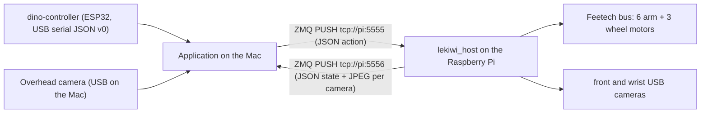

<!-- docs/lekiwi-app-development.md: Explain how application code in this repository uses the LeKiwi robot through the LeRobot fork, and where training work lives instead. -->
# LeKiwi Application Development Guide

Written: 2026-09-24. Status: verified runtime facts from the working teleoperation session on that date, plus the Manual Mode (formerly Drive Mode) application layout, which is implemented and unit-tested without hardware; its base-driving half was owner-tested on the robot for controller driving on 2026-09-24. Anything marked *Proposal* or *owner decision pending* describes intent, not tested behavior.

## 1. Two repositories, two roles

| Repository | Role | What lives there |
| --- | --- | --- |
| `../lerobot-dino-egg-catch-challenge` (LeRobot fork, `lerobot` 0.6.2, Python 3.12+) | Robot runtime and learning | LeKiwi host process on the Raspberry Pi, camera/motor configuration, calibration files (`dino_kiwi.json`, `dino_leader_arm.json` in the repository root), dataset recording, ACT/SmolVLA training and evaluation |
| `dino-egg-catch-challenge` (this repository) | Attendee-facing application | Manual Mode teleoperation with the dino-controller and the leader arm, KachiButton controls, the three-camera view, and the Gemini Robotics task service described in [dino-egg-catch-challenge-gemini-integration.md](proposals/dino-egg-catch-challenge-gemini-integration.md) |

Application code here imports LeRobot as a library. Nothing in this repository needs to be added inside the fork. The fork changes only when the robot itself changes: camera devices, motor settings, host timing, or training pipelines.

Egg pick-up and basket placement policies (ACT first, SmolVLA as a comparison) are trained in the fork. This repository consumes trained checkpoints through a policy-execution component; it does not run `lerobot-train`.

## 2. Runtime topology (verified 2026-09-24)



- The Raspberry Pi (`pi@lekiwi`, conda env `lerobot312`) runs the host from `~/lerobot-dino-egg-catch-challenge`:

  ```bash
  python -m lerobot.robots.lekiwi.lekiwi_host --robot.id=dino_kiwi
  ```

- Front and wrist cameras are opened on the Pi, JPEG-encoded at quality 90, and streamed with the arm state. Both are configured as 640x480, MJPG, no rotation. Rotation, if ever needed, is applied on the Pi inside `OpenCVCamera`; changing the Mac-side config does not rotate anything.
- The host stops the base if no command arrives for 500 ms (`watchdog_timeout_ms`). It exits after `connection_time_s`, now 36000 s in the fork.
- Actions and observations are flat dictionaries. Arm keys are `arm_shoulder_pan.pos`, `arm_shoulder_lift.pos`, `arm_elbow_flex.pos`, `arm_wrist_flex.pos`, `arm_wrist_roll.pos`, `arm_gripper.pos` (degrees, gripper in percent). Base keys are `x.vel`, `y.vel` (m/s, body frame) and `theta.vel` (deg/s). The host requires all three base keys, and an action with no arm keys makes the host's `Goal_Position` sync write raise on an empty motor set (code reading of the fork, not tested on the robot), so the application always sends the six arm keys.

### Pitfall found during setup

Python on the Pi once imported a stale checkout at `/home/pi/lerobot` instead of the challenge fork, so configuration edits appeared to have no effect. Verify the import path after any environment change:

```bash
python -c "import lerobot.robots.lekiwi.config_lekiwi as c; print(c.__file__)"
```

If the path is not under `~/lerobot-dino-egg-catch-challenge`, run `pip install -e .` inside that checkout. A `ConnectionError ... Incorrect status packet!` during `connect()` is a transient Feetech bus error; rerunning the host is the first remedy.

## 3. Environment for this repository

- Python 3.12 or newer, matching the fork's `requires-python`.
- Install the fork as an editable dependency with the LeKiwi and visualization extras. The `lekiwi` extra pulls `pyzmq` and the Feetech stack; `viz` pulls `rerun-sdk`.

  ```bash
  uv add --editable "../lerobot-dino-egg-catch-challenge[lekiwi,viz]"
  uv add pyserial
  ```

  On the Mac this was done in the conda env `lerobot312` on 2026-09-24 with `pip install -e ".[lekiwi,viz]"` inside the fork (plus pyserial and pygame-ce); `python -c "import lerobot; print(lerobot.__file__)"` there prints a path under `lerobot-dino-egg-catch-challenge` (verified).

- Calibration files are read from `~/.cache/huggingface/lerobot/calibration/`. Copy the committed files from the fork root before first use on a new machine:

  | Fork file | Destination |
  | --- | --- |
  | `dino_kiwi.json` | `robots/lekiwi/dino_kiwi.json` on the Pi |
  | `dino_leader_arm.json` | `teleoperators/so_leader/dino_leader_arm.json` on the Mac |

  The leader arm class is named `so_leader` internally, so the `so100_leader` and `so101_leader` config types both read from the `so_leader/` directory.

- Keep the Pi address, serial ports, and camera indices in `src/robot/config.py` as required by `AGENTS.md`. Current values from the working session: Pi at `10.102.6.48`, leader arm at `/dev/tty.usbmodem5A7A0179021`.

## 4. LeRobot API surface used by the application

These calls are verified against the fork source and the working example `examples/lekiwi/teleoperate.py`.

| Need | Import | Notes |
| --- | --- | --- |
| Talk to the robot | `from lerobot.robots.lekiwi import LeKiwiClient, LeKiwiClientConfig` | `LeKiwiClientConfig(remote_ip=..., id=...)`, then `connect()`, `get_observation()`, `send_action(dict)`, `disconnect()` |
| Overhead camera on the Mac | `from lerobot.cameras.opencv import OpenCVCamera, OpenCVCameraConfig` | `connect()`, `read_latest()` returns an HWC array; find the index with `lerobot-find-cameras opencv` |
| Rerun view | `from lerobot.utils.visualization_utils import init_rerun, log_rerun_data` | `log_rerun_data(observation=..., action=...)` logs every dict entry; adding a `top` image key gives the third panel |
| Loop timing | `from lerobot.utils.robot_utils import precise_sleep` | Example loop runs at 30 Hz |
| Optional puppet input | `from lerobot.teleoperators.so_leader import SO100Leader, SO100LeaderConfig` | `get_action()` returns joint keys without the `arm_` prefix; add it before sending |

`get_observation()` returns the nine state keys, an `observation.state` vector, and one image per remote camera (`front`, `wrist`). These arrays are RGB-ordered, not BGR: the Pi's `OpenCVCamera` converts to RGB (its default `color_mode`, not overridden by `config_lekiwi.py`), `lekiwi_host.py` JPEG-encodes that array with `cv2.imencode` as if it were BGR, and `LeKiwiClient._decode_image` decodes it with `cv2.imdecode` without a conversion (code reading in the fork; the wrong colors were owner-confirmed on the signboard, 2026-09-24). The application converts them to BGR once, right after `get_observation()` (`robot/vision/frames.py`, switchable with `PI_CAMERA_COLOR_ORDER`), so the detector, signboard, captures, and Rerun all receive BGR like the overhead camera. The reference base-velocity mapping is `LeKiwiClient._from_keyboard_to_base_action`; its three speed levels are 0.1/0.2/0.3 m/s paired with 30/60/90 deg/s.

Do not send the overhead camera through `LeKiwiClientConfig.cameras`. That field declares cameras the Pi streams; a Mac-side camera is opened and logged by the application directly.

## 5. Application layout (implemented, unit-tested without hardware)

Following the working agreements (single-purpose modules, 300-line limit, tunables in `config.py`, hardware-independent tests). The operating modes (Manual Mode, Auto Catch, Auto Release, Full Self-Catching (FSC)) and the KachiButton controls are specified in [spec/operating-modes.md](spec/operating-modes.md). Phase 1 is implemented: Manual Mode (base driving with the dino-controller plus leader-arm puppeteering with slow engagement), the mode manager, KachiButton phrase detection through the signboard, and the mode text on the signboard. Phase 2 step 1 (unit-tested only, not yet run on the robot): `Hi!` in Manual Mode checks the front-camera egg detection (precondition alerts) and aligns the base to the best egg position; the catch itself, Auto Release, and FSC are still display-only stubs. Details, run commands, the KachiButton table, and the input mapping are in [src/robot/README.md](../src/robot/README.md).

```
pyproject.toml               # LeRobot fork [lekiwi,viz] + pyserial + pygame-ce; uv package = false
src/robot/
  config.py                  # Pi address, ZMQ ports, serial ports, leader arm, KachiButton phrases, speed levels, roles
  dino_controller_reader.py  # serial JSON v0 lines -> immutable ControllerState (stdlib + lazy pyserial)
  controller_to_action.py    # ControllerState -> {x.vel, y.vel, theta.vel}; pure function
  drive_state.py             # frozen DriveState and the stop/drive decision; pure
  kachi_phrases.py           # typed text -> KachiButton commands (exact phrases, 1 s gap); pure
  mode_manager.py            # frozen AppState and the Stop / mode toggle / Hi! / Thx rules, Auto Catch start/finish; pure
  align.py                   # image-based base alignment controller for Auto Catch; pure
  arm_follow.py              # slow engagement toward the leader pose, then following; pure
  manual_mode.py             # per-frame composition: commands, alignment, base action, arm pose, arm status; pure
  display_status.py          # frozen DisplayStatus and overlays (target guide, egg) sent to the signboard; pure
  vision/
    egg_size.py              # EggDetection record and the size precondition; pure
    egg_detector.py          # HSV color egg detector on the front frame (numpy + lazy OpenCV)
    frames.py                # Pi front/wrist frames RGB -> BGR right after observe() (numpy)
    timing.py                # one-time detector timing log; pure
    capture.py               # `c` key: save raw frames + detections to captures/ (lazy OpenCV)
    inspect.py               # offline CLI: python -m robot.vision.inspect <image.png> [--rgb]
  leader_arm.py              # SO100Leader wrapper: read_pose() -> six arm_* keys or None (lazy LeRobot)
  top_camera.py              # OpenCVCamera wrapper for the overhead view
  lekiwi_adapter.py          # LeKiwiClient wrapper: connect + capture arm pose, observe, send base + arm pose, stop
  signboard_layout.py        # pure signboard layout and three-line status text
  signboard.py               # pygame attendee signboard: draw, ESC/close, typed text (child only)
  signboard_protocol.py      # pipe packets (JSON header incl. overlays + raw BGR frames) and command lines
  signboard_process.py       # signboard child entry point; prints KachiButton commands; never imports LeRobot or cv2
  signboard_client.py        # starts the child, streams the newest packet, collects commands
  drive_loop.py              # one loop iteration + 30 Hz loop: controller, commands, leader, adapter, cameras, detector, views
  teleop_drive.py            # Manual Mode entry point: CLI, connect, zeros-first shutdown
tests/robot/
  test_dino_controller_reader.py
  test_controller_to_action.py
  test_drive_state.py
  test_kachi_phrases.py
  test_mode_manager.py
  test_align.py
  test_egg_size.py
  test_frames.py
  test_detect_timing.py
  test_arm_follow.py
  test_manual_mode.py
  test_leader_arm.py
  test_lekiwi_adapter.py
  test_signboard_layout.py
  test_signboard.py
  test_drive_loop.py
  test_drive_loop_auto_catch.py
  loop_fakes.py              # fake devices shared by the two loop tests
  test_signboard_protocol.py
  test_signboard_client.py
  test_vision_suite.py       # runs tests/robot/vision (OpenCV) in its own interpreter
  vision/                    # no __init__.py: OpenCV tests kept out of the pygame test process
    test_egg_detector.py
    test_capture_inspect.py
```

The dino-controller protocol is specified in [dino-controller-protocol.md](dino-controller-protocol.md). The reader buffers to LF, tolerates ESP32 boot text, requires a combined `state` snapshot before applying input, replaces the cached joystick state on every `joystick` or `state` message, and drops held inputs after `ready`, `error`, or a sequence gap. Held directions are not repeated, so the action mapper works from the latest cached state at loop rate rather than from events. Because unchanged inputs produce no traffic, the reader sends `STATE` every 0.2 s so that a 0.5 s silence reliably means input loss.

The attendee display is a pygame signboard window (owner decision, 2026-09-24); Rerun is an operator-only view and is opt-in (`--rerun`). The signboard runs as a separate interpreter fed over a pipe, because opencv and pygame each bundle `libSDL2` on macOS and cannot safely share one process. The signboard window keeps keyboard focus, so KachiButton phrases arrive there and return to the control loop as JSON command lines on the child's stdout.

### Owner decisions (2026-09-24)

| Input | Decision | Implementation in `config.py` |
| --- | --- | --- |
| Joystick | Up / down / left / right translate the base forward / backward / left / right | `LEFT_RIGHT_ROLE = "strafe"`: `x.vel` and `y.vel` |
| Rotary encoder | cw rotates right, ccw rotates left; one click turns the base by half the knob's own angle per click (360° / detents × 0.5; currently assumed 20 detents = 9°), open-loop; the detent count needs the counted test | `ENCODER_ROLE = "rotate_base"`: `ENCODER_DEGREES_PER_STEP = 360 / ENCODER_CLICKS_PER_REVOLUTION * ENCODER_ROTATION_SCALE` (scale 0.5); "Detent calibration" is pending in [dino-controller-validation.md](dino-controller-validation.md). The budget is spent at the level's `theta` speed and capped at `ENCODER_MAX_PENDING_DEG` (360°, a runaway guard to tune on the robot) |
| Speed level | Not changed by any input | Fixed at `INITIAL_SPEED_INDEX` (slow: 0.1 m/s, 30 deg/s) |

### Earlier open questions and current config.py defaults

| Question | Options under consideration | Default in `config.py` |
| --- | --- | --- |
| Arm during Manual Mode | Superseded by the owner decisions in [spec/operating-modes.md](spec/operating-modes.md): the arm follows the leader arm after a slow engagement | Pose observed at connect held until engagement; last commanded pose held in FSC, after `Stop`, on a leader fault, and with `--no-leader`. `ARM_ENGAGE_SPEED_DEG_S` (30) and `ARM_ENGAGE_TOLERANCE_DEG` (3) are proposals to tune on the robot |
| Shaft button role | Decided in [spec/operating-modes.md](spec/operating-modes.md), section 3: no role (Catch moved to `Hi!`, stop is the second KachiButton) | `SHAFT_BUTTON_ROLE = "none"`: reserved, still wired and reported; the former `"catch"` role remains available |
| Loss of controller input | Send zero velocities immediately; the host watchdog is a backstop, not the primary stop | Zero velocities after 0.5 s without a valid message or while unsynchronized (`CONTROLLER_INPUT_TIMEOUT_S`) |

Input loss, `Stop` (latched until `Go Go!`), mode switches, and the optional Catch role all clear the pending encoder rotation, so the base never resumes turning on its own after a stop.

## 6. Recording data and training (done in the fork)

Recording uses the fork's CLI with the client robot and the leader arm as the teleoperator, following the upstream LeKiwi guide at `docs/source/lekiwi.mdx`:

```bash
lerobot-record \
  --robot.type=lekiwi_client --robot.remote_ip=10.102.6.48 --robot.id=dino_kiwi \
  --teleop.type=so100_leader --teleop.port=/dev/tty.usbmodem5A7A0179021 --teleop.id=dino_leader_arm \
  --dataset.repo_id=<user>/dino_pick_egg --dataset.num_episodes=50 --dataset.single_task="Pick up the egg"
```

Constraints to plan around:

- `lerobot-record` stores only the cameras the client declares, so recorded episodes contain `front` and `wrist`. Including the overhead camera in a dataset needs either a host-side camera on the Pi or a wrapper robot class; treat that as fork work if it becomes necessary.
- The concept notes that a wrist-only ACT policy outperformed front+wrist on the golf-ball test. Start `pick_egg` with the wrist camera and add `front` only after a comparison.
- Skill boundaries (`pick_egg`, `place_in_basket`), start and end conditions, and success checks are defined in the Gemini integration document, section 7. Recording sessions should reproduce those start conditions.
- Training and evaluation commands, policy choice, and step counts are covered by the fork's `AGENT_GUIDE.md`.

The application later loads the resulting checkpoint through a policy-execution component that feeds `wrist` frames and joint state, and that can be interrupted mid-sequence. That component is not designed yet.

## 7. Safety rules for application code

- Emergency stop and motion limits stay local to the Mac application and the Pi host; never route a stop through Gemini or any network service.
- Zero the base velocities whenever controller input is lost or the UI loses focus. The 500 ms host watchdog is the last line, not the first.
- Never run `lekiwi_host` from two checkouts or two terminals against the same motor bus.
- Validate changes without motion first: the controller reader and action mapper are testable with recorded serial lines and need no robot.

## 8. Verified versus assumed

Verified on 2026-09-24: host start command, ZMQ ports, action and observation keys, camera configuration, watchdog and connection time, calibration file locations, the stale-checkout pitfall, and the API names listed in section 4.

Implemented, unit-tested without hardware: the Manual Mode module layout in section 5 (controller reader, action mapper, drive state with the encoder rotation budget, adapter action content with a fake client, KachiButton phrase detection, the mode manager with the Stop latch, leader-arm slow engagement and following with a fake teleoperator, and the signboard command channel). Owner-tested on the robot (2026-09-24): Manual Mode end to end, including catching an egg with the leader arm, `Go Go!` mode switching from a KachiButton in the real signboard window, and the slow re-synchronization after FSC. `Stop` on the second KachiButton is not yet reported. The joystick, encoder, and speed-level roles are owner decisions (2026-09-24); one click turns the base by half the knob's own angle per click (360° / detents × 0.5; currently assumed 20 detents = 9°), open-loop; the detent count needs the counted test. The hardware modules import and `python -m robot.teleop_drive --help` runs in the `lerobot312` environment. Owner-tested on the robot (2026-09-24): driving the base with the dino-controller (Manual Mode's base-driving half) works as reported by the owner; the rotation angle per click, the overhead camera, and the on-screen signboard were not separately reported.

Assumed or proposed: the engagement speed and tolerance, the encoder detent count (20 assumed) and rotation cap, the empty-arm-action failure (code reading only), the recording command's dataset arguments, and every statement about policy execution. Update this document when those become implementation.
