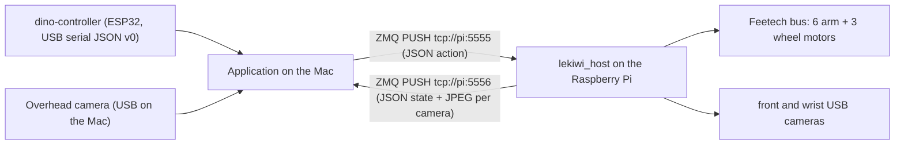

<!-- docs/lekiwi-app-development.md: Explain how application code in this repository uses the LeKiwi robot through the LeRobot fork, and where training work lives instead. -->
# LeKiwi Application Development Guide

Written: 2026-09-24. Status: verified runtime facts from the working teleoperation session on that date, plus the Manual Mode (formerly Drive Mode) application layout, which is implemented and unit-tested without hardware; its base-driving half was owner-tested on the robot for controller driving on 2026-09-24. Anything marked *Proposal* or *owner decision pending* describes intent, not tested behavior.

## 1. Two repositories, two roles

| Repository | Role | What lives there |
| --- | --- | --- |
| `../lerobot-dino-egg-catch-challenge` (LeRobot fork, `lerobot` 0.6.2, Python 3.12+) | Robot runtime and learning | LeKiwi host process on the Raspberry Pi, camera/motor configuration, calibration files (`dino_kiwi.json`, `dino_leader_arm.json` in the repository root), dataset recording, ACT/SmolVLA training and evaluation |
| `dino-egg-catch-challenge` (this repository) | Attendee-facing application | Manual Mode teleoperation with the dino-controller and the leader arm, KachiButton controls, the three-camera view, and the Gemini Robotics task service described in [dino-egg-catch-challenge-gemini-integration.md](proposals/dino-egg-catch-challenge-gemini-integration.md) |

Application code here imports LeRobot as a library. Nothing in this repository needs to be added inside the fork. The fork changes only when the robot itself changes: camera devices, motor settings, host timing, or training pipelines.

Egg pick-up and basket placement policies (ACT first, SmolVLA as a comparison) are trained in the fork. This repository consumes trained checkpoints through a policy-execution component; it does not run `lerobot-train`.

## 2. Runtime topology (verified 2026-09-24)



- The Raspberry Pi (`pi@lekiwi`, conda env `lerobot312`) runs the host from `~/lerobot-dino-egg-catch-challenge`:

  ```bash
  ./examples/lekiwi/start_dino_host.sh    # applies the camera controls, then runs lekiwi_host --robot.id=dino_kiwi
  ```

  The wrapper (fork, 2026-09-25) runs `examples/lekiwi/dino_camera_settings.sh` first: the wrist camera's auto exposure lowered its rate to about 8 fps in dim light and its autofocus hunted, so it is set to a fixed 30 fps with focus 100; the front camera's auto exposure halved it to 15 fps, so it uses manual exposure (33 ms, gain 63). Without these controls the recorded datasets and the live feeds contain many repeated frames (62 percent of wrist frames in the first green dataset). `examples/lekiwi/99-dino-cameras.rules` re-applies them from udev after a replug. Plain `python -m lerobot.robots.lekiwi.lekiwi_host --robot.id=dino_kiwi` still works but leaves the cameras at their defaults.

  ```bash
  # equivalent without the wrapper
  python -m lerobot.robots.lekiwi.lekiwi_host --robot.id=dino_kiwi
  ```

- Front and wrist cameras are opened on the Pi, JPEG-encoded at quality 90, and streamed with the arm state. Both are configured as 640x480, MJPG, no rotation. Rotation, if ever needed, is applied on the Pi inside `OpenCVCamera`; changing the Mac-side config does not rotate anything.
- The host stops the base if no command arrives for 500 ms (`watchdog_timeout_ms`). It exits after `connection_time_s`, now 36000 s in the fork.
- Actions and observations are flat dictionaries. Arm keys are `arm_shoulder_pan.pos`, `arm_shoulder_lift.pos`, `arm_elbow_flex.pos`, `arm_wrist_flex.pos`, `arm_wrist_roll.pos`, `arm_gripper.pos` (degrees, gripper in percent). Base keys are `x.vel`, `y.vel` (m/s, body frame) and `theta.vel` (deg/s). The host requires all three base keys, and an action with no arm keys makes the host's `Goal_Position` sync write raise on an empty motor set (code reading of the fork, not tested on the robot), so the application always sends the six arm keys.

### Pitfall found during setup

Python on the Pi once imported a stale checkout at `/home/pi/lerobot` instead of the challenge fork, so configuration edits appeared to have no effect. Verify the import path after any environment change:

```bash
python -c "import lerobot.robots.lekiwi.config_lekiwi as c; print(c.__file__)"
```

If the path is not under `~/lerobot-dino-egg-catch-challenge`, run `pip install -e .` inside that checkout. A `ConnectionError ... Incorrect status packet!` during `connect()` is a transient Feetech bus error; rerunning the host is the first remedy.

## 3. Environment for this repository

- Python 3.12 or newer, matching the fork's `requires-python`.
- Install the fork as an editable dependency with the LeKiwi and visualization extras. The `lekiwi` extra pulls `pyzmq` and the Feetech stack; `viz` pulls `rerun-sdk`.

  ```bash
  uv add --editable "../lerobot-dino-egg-catch-challenge[lekiwi,viz]"
  uv add pyserial
  ```

  On the Mac this was done in the conda env `lerobot312` on 2026-09-24 with `pip install -e ".[lekiwi,viz]"` inside the fork (plus pyserial and pygame-ce); `python -c "import lerobot; print(lerobot.__file__)"` there prints a path under `lerobot-dino-egg-catch-challenge` (verified).

- OpenCV contrib (owner-approved, 2026-09-24): the `lerobot312` env has `opencv-contrib-python-headless==4.13.0.92` instead of the `opencv-python-headless` that LeRobot pulls. Both wheels install the same `cv2` module, so the contrib wheel must replace the plain one in the same env; it adds `cv2.ximgproc` (EdgeDrawing) for the egg detector's default "edge" spot stage (it falls back to "hsv" without it), and LeRobot still imports. `pyproject.toml` lists it for the `uv` setup.

- Calibration files are read from `~/.cache/huggingface/lerobot/calibration/`. Copy the committed files from the fork root before first use on a new machine:

  | Fork file | Destination |
  | --- | --- |
  | `dino_kiwi.json` | `robots/lekiwi/dino_kiwi.json` on the Pi |
  | `dino_leader_arm.json` | `teleoperators/so_leader/dino_leader_arm.json` on the Mac |

  The leader arm class is named `so_leader` internally, so the `so100_leader` and `so101_leader` config types both read from the `so_leader/` directory.

- Keep the Pi address, serial ports, and camera indices in `src/robot/config.py` as required by `AGENTS.md`. Current values from the working session: Pi at `192.168.2.9`, leader arm at `/dev/tty.usbmodem5A7A0179021`.

## 4. LeRobot API surface used by the application

These calls are verified against the fork source and the working example `examples/lekiwi/teleoperate.py`.

| Need | Import | Notes |
| --- | --- | --- |
| Talk to the robot | `from lerobot.robots.lekiwi import LeKiwiClient, LeKiwiClientConfig` | `LeKiwiClientConfig(remote_ip=..., id=...)`, then `connect()`, `get_observation()`, `send_action(dict)`, `disconnect()` |
| Overhead camera on the Mac | `from lerobot.cameras.opencv import OpenCVCamera, OpenCVCameraConfig` | `connect()`, `read_latest()` returns an HWC array; find the index with `lerobot-find-cameras opencv` |
| Rerun view | `from lerobot.utils.visualization_utils import init_rerun, log_rerun_data` | `log_rerun_data(observation=..., action=...)` logs every dict entry; adding a `top` image key gives the third panel |
| Loop timing | `from lerobot.utils.robot_utils import precise_sleep` | Example loop runs at 30 Hz |
| Optional puppet input | `from lerobot.teleoperators.so_leader import SO100Leader, SO100LeaderConfig` | `get_action()` returns joint keys without the `arm_` prefix; add it before sending |

`get_observation()` returns the nine state keys, an `observation.state` vector, and one image per remote camera (`front`, `wrist`). These arrays are RGB-ordered, not BGR: the Pi's `OpenCVCamera` converts to RGB (its default `color_mode`, not overridden by `config_lekiwi.py`), `lekiwi_host.py` JPEG-encodes that array with `cv2.imencode` as if it were BGR, and `LeKiwiClient._decode_image` decodes it with `cv2.imdecode` without a conversion (code reading in the fork; the wrong colors were owner-confirmed on the signboard, 2026-09-24). The application converts them to BGR once, right after `get_observation()` (`robot/vision/frames.py`, switchable with `PI_CAMERA_COLOR_ORDER`), so the detector, signboard, captures, and Rerun all receive BGR like the overhead camera. The reference base-velocity mapping is `LeKiwiClient._from_keyboard_to_base_action`; its three speed levels are 0.1/0.2/0.3 m/s paired with 30/60/90 deg/s.

Do not send the overhead camera through `LeKiwiClientConfig.cameras`. That field declares cameras the Pi streams; a Mac-side camera is opened and logged by the application directly.

## 5. Application layout (implemented, unit-tested without hardware)

Following the working agreements (single-purpose modules, 300-line limit, tunables in `config.py`, hardware-independent tests). The operating modes (Manual Mode, Auto Catch, Auto Release, Full Self-Catching (FSC)) and the KachiButton controls are specified in [spec/operating-modes.md](spec/operating-modes.md). Phase 1 is implemented: Manual Mode (base driving with the dino-controller plus leader-arm puppeteering with slow engagement), the mode manager, KachiButton phrase detection through the signboard, and the mode text on the signboard. Phase 2 step 1 (unit-tested only, not yet run on the robot): `Hi!` in Manual Mode checks the front-camera egg detection (precondition alerts) and aligns the base to the best egg position; `Thx` runs Auto Release (basket precondition, base alignment to the basket, home pose with the egg held, recorded release motion played slowly; unit-tested only, the home pose and motion are recorded by staff into `data/arm/`); FSC is still a display-only stub. Phase 3 step 1 (unit-tested only): after the alignment, Auto Catch moves the arm slowly to the recorded catch pose, optionally checks the wrist view for the egg (disabled by default), runs the pick policy (Phase 3 step 3, section 6; a stub when no checkpoint is loaded), and returns to the release pose. Details, run commands, the KachiButton table, and the input mapping are in [src/robot/README.md](../src/robot/README.md).

```
pyproject.toml               # LeRobot fork [lekiwi,viz] + pyserial + pygame-ce; uv package = false
data/arm/                    # arm data recorded on the robot (staff keys b / r / k): home_pose.json (release pose),
                             # release_motion.json, catch_pose.json
src/robot/
  config.py                  # Pi address, ZMQ ports, serial ports, leader arm, KachiButton phrases, speed levels, roles
  dino_controller_reader.py  # serial JSON v0 lines -> immutable ControllerState (stdlib + lazy pyserial)
  controller_to_action.py    # ControllerState -> {x.vel, y.vel, theta.vel}; pure function
  drive_state.py             # frozen DriveState and the stop/drive decision; pure
  kachi_phrases.py           # typed text -> KachiButton commands (exact phrases, 1 s gap); pure
  mode_manager.py            # frozen AppState and the Stop / mode toggle / Hi! / Thx rules, Auto Catch start/finish; pure
  align.py                   # base alignment (egg: cx + height; basket: cx + width): tapered speed, smoothing, rate limit; pure
  arm_follow.py              # slow engagement toward the leader pose, then following; approach_pose / within; pure
  auto_release.py            # Auto Release state machine: align, home (gripper kept), play, return home; pure
  auto_catch.py              # Auto Catch state machine: align, catch pose, wrist check, pick (policy or stub), release pose; pure
  policy/                    # pick policy: config_policy + pick_step (pure), pick_policy + lerobot_policy (lazy torch)
  arm_motions.py             # home pose / release motion files: validate, resample, time-scale, atomic write (stdlib)
  arm_store.py               # staff keys b (save home), k (save catch), r (record release); loads files at Thx / Hi!
  manual_mode.py             # per-frame composition: commands, alignment, base action, arm pose, arm status; pure
  display_status.py          # frozen DisplayStatus and overlays (target guide, egg) sent to the signboard; pure
  vision/
    egg_size.py              # EggDetection record and the size precondition; pure
    basket_size.py           # BasketDetection record and the Auto Release size precondition; pure
    basket_detector.py       # pink basket: loose HSV, half-size open/close, largest component (lazy OpenCV)
    config_vision.py         # egg and basket detector tunables, Auto Release basket target and tolerances
    egg_masks.py             # color masks, spot blobs, spot clusters (numpy + cv2 passed in)
    spot_edges.py            # default spot stage: EdgeDrawing + white ring (OpenCV contrib)
    egg_detector.py          # spot-anchored, scale-adaptive egg segmentation + shape rules (lazy OpenCV)
    frames.py                # Pi front/wrist frames RGB -> BGR right after observe() (numpy)
    top_frame.py             # overhead 1280x720 -> 960x540 once per frame (lazy OpenCV)
    timing.py                # one-time detector timing log; pure
    align_trace.py           # per-frame alignment CSV trace in captures/ (stdlib)
    wrist_check.py           # Auto Catch wrist-view check: full egg or a ringed spot cluster (lazy OpenCV)
    capture.py               # `c` key: save raw frames + detections to captures/ (lazy OpenCV)
    inspect.py               # offline CLI: python -m robot.vision.inspect <image.png> [--rgb] [--debug] [--basket] [--wrist]
  leader_arm.py              # SO100Leader wrapper: read_pose() -> six arm_* keys or None (lazy LeRobot)
  top_camera.py              # OpenCVCamera wrapper for the overhead view (1280x720, 16:9: full field of view)
  lekiwi_adapter.py          # LeKiwiClient wrapper: connect + capture arm pose, observe, send base + arm pose, stop
  signboard_layout.py        # pure signboard layout and three-line status text
  signboard.py               # pygame attendee signboard: draw, ESC/close, typed text (child only)
  signboard_protocol.py      # pipe packets (JSON header incl. overlays + raw BGR frames) and command lines
  signboard_process.py       # signboard child entry point; prints KachiButton commands; never imports LeRobot or cv2
  signboard_client.py        # starts the child, streams the newest packet, collects commands
  drive_loop.py              # one loop iteration + 30 Hz loop: controller, commands, leader, adapter, cameras, detector, views
  teleop_drive.py            # Manual Mode entry point: CLI, connect, zeros-first shutdown
tests/robot/
  test_dino_controller_reader.py
  test_controller_to_action.py
  test_drive_state.py
  test_kachi_phrases.py
  test_mode_manager.py
  test_align.py
  test_align_trace.py
  test_egg_size.py
  test_frames.py
  test_detect_timing.py
  test_arm_follow.py
  test_manual_mode.py
  test_auto_release.py
  test_auto_catch.py
  test_mode_manager_catch.py
  test_mode_manager_release.py
  test_arm_motions.py
  test_arm_store.py
  test_basket_size.py
  test_leader_arm.py
  test_lekiwi_adapter.py
  test_signboard_layout.py
  test_signboard.py
  test_drive_loop.py
  test_drive_loop_auto_catch.py
  test_drive_loop_release.py
  test_drive_loop_catch.py
  loop_fakes.py              # fake devices shared by the loop tests
  test_signboard_protocol.py
  test_signboard_client.py
  test_vision_suite.py       # runs tests/robot/vision (OpenCV) in its own interpreter
  vision/                    # no __init__.py: OpenCV tests kept out of the pygame test process
    test_egg_detector.py
    test_capture_inspect.py
    test_top_frame.py
    test_basket_detector.py
    test_wrist_check.py
```

The dino-controller protocol is specified in [dino-controller-protocol.md](dino-controller-protocol.md). The reader buffers to LF, tolerates ESP32 boot text, requires a combined `state` snapshot before applying input, replaces the cached joystick state on every `joystick` or `state` message, and drops held inputs after `ready`, `error`, or a sequence gap. Held directions are not repeated, so the action mapper works from the latest cached state at loop rate rather than from events. Because unchanged inputs produce no traffic, the reader sends `STATE` every 0.2 s so that a 0.5 s silence reliably means input loss.

The attendee display is a pygame signboard window (owner decision, 2026-09-24); Rerun is an operator-only view and is opt-in (`--rerun`). The signboard runs as a separate interpreter fed over a pipe, because opencv and pygame each bundle `libSDL2` on macOS and cannot safely share one process. The signboard window keeps keyboard focus, so KachiButton phrases arrive there and return to the control loop as JSON command lines on the child's stdout.

### Owner decisions (2026-09-24)

| Input | Decision | Implementation in `config.py` |
| --- | --- | --- |
| Joystick | Up / down / left / right translate the base forward / backward / left / right | `LEFT_RIGHT_ROLE = "strafe"`: `x.vel` and `y.vel` |
| Rotary encoder | cw rotates right, ccw rotates left; one click turns the base by half the knob's own angle per click (360° / detents × 0.5; currently assumed 20 detents = 9°), open-loop; the detent count needs the counted test | `ENCODER_ROLE = "rotate_base"`: `ENCODER_DEGREES_PER_STEP = 360 / ENCODER_CLICKS_PER_REVOLUTION * ENCODER_ROTATION_SCALE` (scale 0.5); "Detent calibration" is pending in [dino-controller-validation.md](dino-controller-validation.md). The budget is spent at the level's `theta` speed and capped at `ENCODER_MAX_PENDING_DEG` (360°, a runaway guard to tune on the robot) |
| Speed level | Not changed by any input | Fixed at `INITIAL_SPEED_INDEX` (slow: 0.1 m/s, 30 deg/s) |

### Earlier open questions and current config.py defaults

| Question | Options under consideration | Default in `config.py` |
| --- | --- | --- |
| Arm during Manual Mode | Superseded by the owner decisions in [spec/operating-modes.md](spec/operating-modes.md): the arm follows the leader arm after a slow engagement | Pose observed at connect held until engagement; last commanded pose held in FSC, after `Stop`, on a leader fault, and with `--no-leader`. `ARM_ENGAGE_SPEED_DEG_S` (30) and `ARM_ENGAGE_TOLERANCE_DEG` (3) are proposals to tune on the robot |
| Shaft button role | Decided in [spec/operating-modes.md](spec/operating-modes.md), section 3: no role (Catch moved to `Hi!`, stop is the second KachiButton) | `SHAFT_BUTTON_ROLE = "none"`: reserved, still wired and reported; the former `"catch"` role remains available |
| Loss of controller input | Send zero velocities immediately; the host watchdog is a backstop, not the primary stop | Zero velocities after 0.5 s without a valid message or while unsynchronized (`CONTROLLER_INPUT_TIMEOUT_S`) |

Input loss, `Stop` (latched until `Go Go!`), mode switches, and the optional Catch role all clear the pending encoder rotation, so the base never resumes turning on its own after a stop.

## 6. Recording data and training

Owner decisions (2026-09-25, [spec/operating-modes.md](spec/operating-modes.md), section 4): the `pick_egg` demonstrations are recorded from the catch pose until the egg is held, into the Hub dataset `CreatorKanata/dino_pick_egg_v2`. The recorder lives in this repository ([src/robot/recording/](../src/robot/recording/)) so it reuses `config.py` (Pi address, leader port and id, the catch pose file). It calls the fork's `record_loop` with the leader arm plus the keyboard teleoperator, as the fork's `examples/lekiwi/record.py` does, because the `lerobot-record` CLI cannot drive LeKiwi with a lone arm teleoperator (compatibility note below). The application reproduces the same start state at demo time through the base alignment and the catch pose (Auto Catch, [src/robot/README.md](../src/robot/README.md)). Training runs on Google Colab Pro from the Hub dataset; the notebook will live in the fork.

**Prerequisites (once per Mac, `lerobot312` env).**

- In the fork root: `pip install -e ".[lekiwi,viz,dataset]"`. The `dataset` extra adds `datasets` and `av` (installed 2026-09-25: `datasets` 4.8.5, `av` 15.1.0).
- Installing any LeRobot extra re-adds `opencv-python-headless` on top of `opencv-contrib-python-headless` and corrupts the shared `cv2` package (the egg detector's synthetic tests start failing). Repair it after every such install: `pip uninstall -y opencv-python-headless opencv-contrib-python-headless && pip install opencv-contrib-python-headless==4.13.0.92`.
- Log in to Hugging Face with `hf auth login` (huggingface_hub 1.32.0 in `lerobot312`; `huggingface-cli` there only prints that it is deprecated and no longer works).
- Give the terminal the macOS Accessibility permission: the keyboard teleoperator and the key listener use `pynput`. Without it the listener falls back to keys typed in the focused terminal, and the base keys do nothing.
- `data/arm/catch_pose.json` must exist (the `k` staff key in Manual Mode; recorded 2026-09-25). The recorder refuses to start without it.
- Close the Manual Mode application: the recorder owns the robot connection. Start the LeKiwi host on the Pi as usual.

**Start state of every episode.**

- The robot is parked on a floor mark taped on the tarp.
- The egg is placed at the marked best position: the app's `place the egg here` outline when the app runs (mark the spot on the tarp with tape once), with deliberate offsets inside the alignment tolerance, about ±3 cm sideways and ±3 cm in depth.
- The arm is at the catch pose (head down, egg in the wrist view); the recorder's start-pose gate puts it there (below).

**Command** (from this repository root). Target 60 episodes split by color, about half green and half red (`yellow` is also accepted); more if the success rate is low. The color goes into the stored task, `Pick up the egg with the mouth (green egg)`, so episodes can be filtered:

```bash
PYTHONPATH=src python -m robot.recording.record_pick_egg --egg-color green --num-episodes 30
PYTHONPATH=src python -m robot.recording.record_pick_egg --egg-color red --num-episodes 30 --resume
```

Defaults (`src/robot/recording/config_recording.py`): `--repo-id CreatorKanata/dino_pick_egg_v2`, `--num-episodes 60` (attempts this session), `--episode-time-s 20`, `--reset-time-s 15`, `--fps 30`, `--task "Pick up the egg with the mouth"`. `--remote-ip` and `--leader-port` default to `config.py`. `--resume` appends to the existing local dataset (the recorder refuses to overwrite one without it), `--root` overrides the dataset directory (default `~/.cache/huggingface/lerobot/<repo-id>`), `--no-push` skips the upload, `--no-rerun` skips the Rerun viewer, and `--voice` sets the speech voice (below).

**Start-pose gate (before every episode).** The follower moves to the catch pose with every joint arriving together (`approach_pose_sync` at `ARM_ENGAGE_SPEED_DEG_S`, the gripper taking the catch pose's value, base velocities zero). The recorder then holds it there until the leader arm is within `GATE_TOLERANCE_DEG` (10°) of the catch pose on every joint except the gripper, and says "Move the leader to the catch pose" with the worst joint and its error, at most every 3 s. Esc aborts the wait and ends the session; after `GATE_TIMEOUT_S` (120 s) the attempt is skipped without recording.

**Voice** (owner trial run, 2026-09-25: the fork's `log_say` ran `say` with the Mac's default Japanese voice, which garbled English, and did not wait, so two announcements overlapped; `LANG`/`LC_ALL` do not change the `say` voice). The recorder speaks through its own `recording/speech.py`: macOS `say -v <voice>` on one worker thread, one utterance at a time. `--voice auto` (`RECORDER_VOICE`) reads `say -v '?'` once at start-up and takes the first installed voice of `RECORDER_VOICE_PREFERENCE` (Samantha, Ava, Allison, Alex, Karen, Daniel, Moira), else the first `en_` voice, else the system default; the choice is logged and printed under the key map. `--voice <name>` forces a voice, `--voice none` turns speech off (the text is still logged). Gate hints are replaceable: a newer hint replaces an unplayed one and is dropped when another message is already queued. Before each episode the recorder waits up to `SPEECH_IDLE_WAIT_S` (3 s) for the queue to go quiet, so "Recording episode N of M" is heard in full; the fork's `record_loop` has no `play_sounds` parameter and does not speak. Off macOS the fork's `say` is used (blocking), without voice selection.

**Keys** (fork `utils/keyboard_input.py`, verified 2026-09-25; printed at start-up): right arrow (or `n`) ends the episode early, left arrow (or `r`) discards and re-records it, Esc (or `q`) stops the session. The base keys of the keyboard teleoperator stay active (`w`/`s`, `a`/`d`, `z`/`x`, `r`/`f` for speed); keep the base parked, and prefer the left arrow over `r`, which also raises the base speed level.

**Episode (owner decision, 2026-09-25).** After "Recording episode N of M, <color> egg", teleoperate with the leader arm: grasp the egg with the mouth, return to the catch pose (this lifts the egg a few centimetres; the lower jaw is fixed, so the held egg is not pressed on the floor), hold still for about one second, then press the right arrow. Every episode ends the same way so the policy learns to stop there; do not raise the arm to the release pose, the application does that. An episode also ends after `--episode-time-s`.

**Reset.** After "Reset", the recorder runs `record_loop` without the dataset for `--reset-time-s` (the arm keeps following the leader): put the egg back on the mark with a new small offset. No reset follows the last attempt unless it is re-recorded. Then the episode is saved (`dataset.save_episode()`, as the fork's CLI does; the base is zeroed first), or discarded after a left arrow, and the gate runs again.

**Session end.** On completion, Esc, or Ctrl+C: zero base velocities, disconnect the robot, then the leader, keyboard, listener, and Rerun; discard an unsaved episode, `dataset.finalize()`, and `dataset.push_to_hub()` unless `--no-push` or no episode exists. Esc keeps the episode in progress (the fork's CLI behavior); Ctrl+C discards it. A summary lists episodes recorded, skipped, and re-recorded, their durations, the dataset root, and whether it was pushed.

**Compatibility note: the `lerobot-record` CLI.** Its flags were verified on 2026-09-25 from the fork (`--robot.type=lekiwi_client`, `--teleop.type=so100_leader`, `--dataset.repo_id`, `--dataset.no_stamp=true` to keep the repository name, `--resume=true`), but with a single `so100_leader` teleoperator `record_loop` sends the leader's keys as they are (`shoulder_pan.pos`, ...), without the `arm_` prefix and without base velocities. The host's `LeKiwi.send_action` then fails on the missing `x.vel`, and `build_dataset_frame` fails because the dataset's action names are `arm_shoulder_pan.pos` and so on. Only the list form (one arm teleoperator plus a `KeyboardTeleop`, `robot.name == "lekiwi_client"`) adds the prefix and the base keys, and the CLI cannot express a list (code reading, not run on the robot). Use the recorder above unless the fork gains a teleop action step that adds both.

**Data.** Episodes contain the cameras the client declares, `front` and `wrist` (640x480 each), plus the arm and base state and actions. Training on `wrist` only (owner decision, consistent with the golf-ball result in the concept) is a policy-configuration choice in the fork; see the fork's `AGENT_GUIDE.md` for training commands, policy choice, and step counts. Including the overhead camera would need a host-side camera or a wrapper robot class (fork work).

**Evaluation.** Keep 10 percent of the episodes as held-out. Success means the egg is held at the end of the episode.

**Inference (after training).** Push the trained checkpoint to the Hub as `CreatorKanata/act_dino_pick_egg` (the training notebook's `--policy.repo_id`). The Manual Mode application loads it at start-up: the download from the Hub is automatic via the repo id (`hf auth login` is already done on this Mac; the files are cached under `~/.cache/huggingface/hub`), so no extra step is needed. To try a checkpoint before pushing it, copy its `checkpoints/last/pretrained_model` directory to the Mac and pass that path; `--pick-policy ''` runs without a policy:

```bash
PYTHONPATH=src python -m robot.teleop_drive                                    # CreatorKanata/act_dino_pick_egg
PYTHONPATH=src python -m robot.teleop_drive --pick-policy outputs/act_dino_pick_egg/checkpoints/last/pretrained_model
PYTHONPATH=src python -m robot.teleop_drive --pick-policy '' --policy-device cpu
```

The runner (`src/robot/policy/`) loads the checkpoint as the fork's `lerobot-rollout` does (policy config and weights from the checkpoint, `make_pre_post_processors` with the normalization stats saved in it, device override only), feeds the raw RGB `wrist` frame (the arrays as `LeKiwiClient` returns them and the dataset stored them, never the application's BGR copies) and the nine-value state from the catch pose, runs the model every frame with ACT temporal ensembling (coefficient 0.01; falls back to `PICK_ACTION_HORIZON` (10) actions per inference when an inference exceeds 28 ms, or with `--no-pick-ensemble`) with the arm capped per frame and the base at zero, stops on a settling rule or after 20 s, and is cancelled by `Stop`. A checkpoint that cannot be loaded leaves Auto Catch on the stub ("Catch: policy not available yet") with a warning. Details, the stop condition, and the measured inference time are in [src/robot/README.md](../src/robot/README.md), "Auto Catch pick policy". Not yet run on the robot, and no trained checkpoint exists yet.

## 7. Safety rules for application code

- Emergency stop and motion limits stay local to the Mac application and the Pi host; never route a stop through Gemini or any network service.
- Zero the base velocities whenever controller input is lost or the UI loses focus. The 500 ms host watchdog is the last line, not the first.
- Never run `lekiwi_host` from two checkouts or two terminals against the same motor bus.
- Validate changes without motion first: the controller reader and action mapper are testable with recorded serial lines and need no robot.

## 8. Verified versus assumed

Verified on 2026-09-24: host start command, ZMQ ports, action and observation keys, camera configuration, watchdog and connection time, calibration file locations, the stale-checkout pitfall, and the API names listed in section 4.

Implemented, unit-tested without hardware: the Manual Mode module layout in section 5 (controller reader, action mapper, drive state with the encoder rotation budget, adapter action content with a fake client, KachiButton phrase detection, the mode manager with the Stop latch, leader-arm slow engagement and following with a fake teleoperator, and the signboard command channel). Owner-tested on the robot (2026-09-24): Manual Mode end to end, including catching an egg with the leader arm, `Go Go!` mode switching from a KachiButton in the real signboard window, and the slow re-synchronization after FSC. `Stop` on the second KachiButton is not yet reported. The joystick, encoder, and speed-level roles are owner decisions (2026-09-24); one click turns the base by half the knob's own angle per click (360° / detents × 0.5; currently assumed 20 detents = 9°), open-loop; the detent count needs the counted test. The hardware modules import and `python -m robot.teleop_drive --help` runs in the `lerobot312` environment. The `pick_egg` recorder in section 6 (gate, episode sequence, LeRobot wiring, shutdown order) is unit-tested with fakes and its `--help` runs; it has not been run on the robot. Owner-tested on the robot (2026-09-24): driving the base with the dino-controller (Manual Mode's base-driving half) works as reported by the owner; the rotation angle per click, the overhead camera, and the on-screen signboard were not separately reported.

Assumed or proposed: the engagement speed and tolerance, the encoder detent count (20 assumed) and rotation cap, the empty-arm-action failure (code reading only), the recorder's dataset values (episode count and times) and gate limits (10° tolerance, 120 s timeout), the single-teleoperator `lerobot-record` blocker in section 6 (code reading only), and every statement about policy execution on the robot (the pick policy runner in section 6 is unit-tested and was run locally on an untrained checkpoint only). Update this document when those become implementation.
